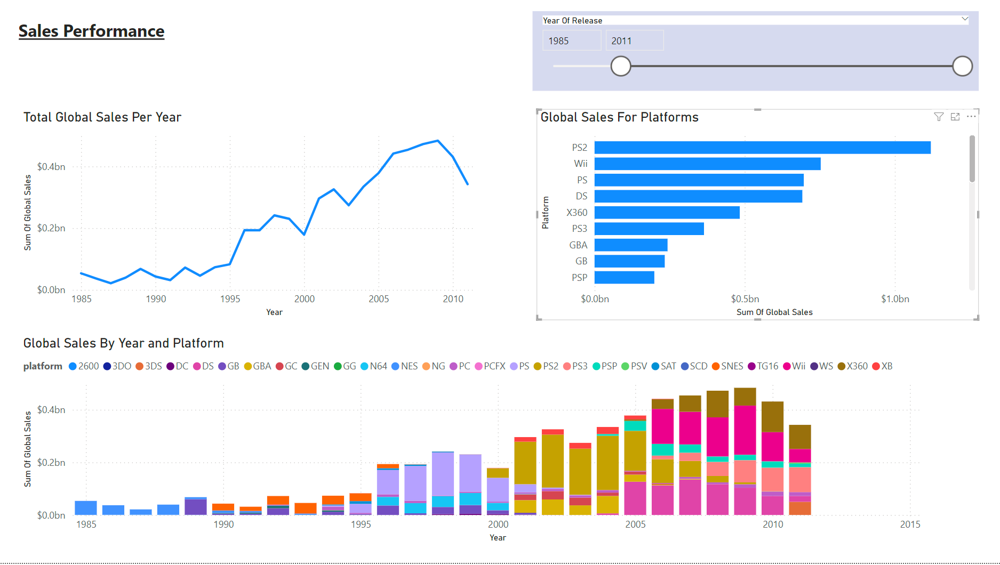
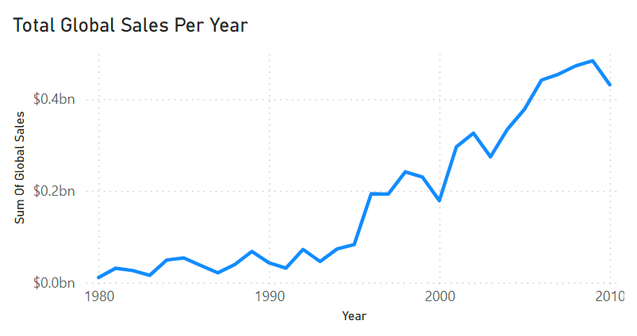
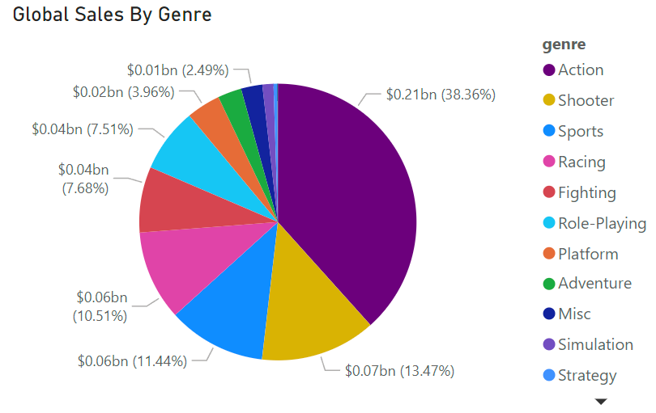
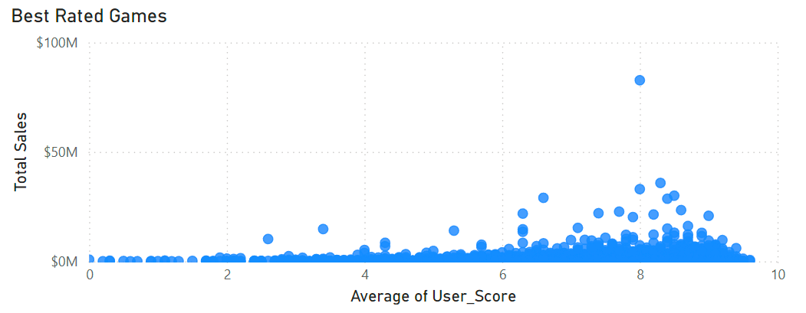
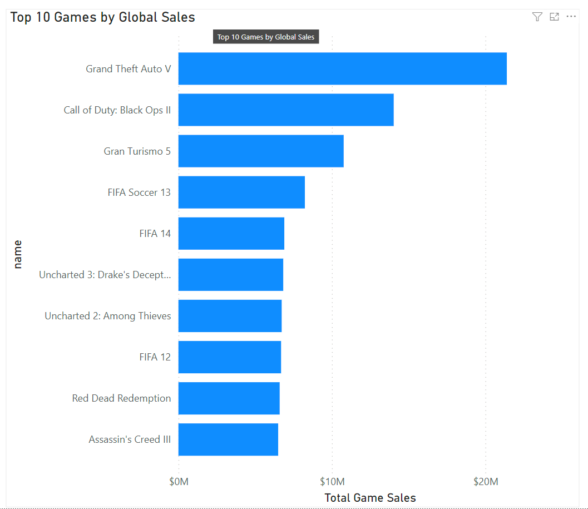
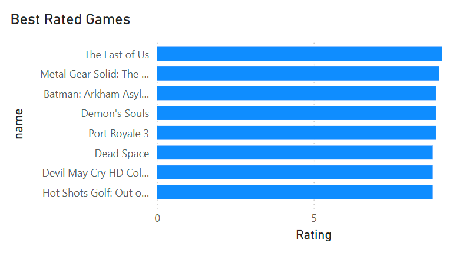

# Project: Video Game Sales & Player Ratings Dashboard

## Project Overview

This project focuses on building a dynamic and interactive Power BI dashboard to analyze video game sales performance, player engagement metrics, and genre trends. The objective is to provide insights for game developers, publishers, and retailers to understand market performance, player behavior, and game preferences across different platforms and regions.

The dashboard integrates multiple datasets, including sales data, player statistics, and game reviews, and offers a comprehensive view of the video game industry. It highlights the relationships between game sales, player engagement, and game genres, allowing stakeholders to make data-driven decisions to optimize marketing, development, and sales strategies.

## Key Skills
<ul>
  <li>Data Modeling: Integrate multiple datasets (sales data, player data, game reviews, etc.).</li>
  <li>Data Cleaning: Remove errors, duplicate and blank rows.</li>
  <li>Visualization: Design an interactive and engaging dashboard with filters for time periods, game genres, and platforms.</li>
</ul>

## Data Sources:
Kaggle: Video game sales data, game ratings, and player data.

## :bulb: Key Features

### 1. **Sales Performance Overview**
   - Visualize total sales, revenue, and sales growth over time.
   - Interactive filters for platform (PC, PlayStation, Xbox) and time period.
   
   - KPIs: Total sales, sales growth percentage, regional and platform-specific performance.
   
 

   
 

### 2. **Game Genre & Platform Analysis**
   - Analyze sales breakdown by game genre (e.g., RPG, FPS, Strategy).
   - Interactive charts showing genre trends across different platforms and regions.
   - Slicers for filtering by platform, game release year gain deeper insights.
   

 

 

### 3. **Game Ratings & Reviews**
   - Analyze game ratings across platforms and regions.
   - KPIs: Average rating per game

 

   
 

  

## Project Goals

- Provide insights into video game sales performance across platforms, regions, and genres.
- Analyze player behavior and engagement metrics to inform game development and marketing strategies.
- Visualize customer feedback and sentiment to improve product development and user satisfaction.

## Conclusion

Upon analyzing the data, one key observation stands out: **there is no significant correlation between game sales and game ratings**. While high-rated games often receive critical acclaim and fan appreciation, their sales performance does not always reflect this.

This observation underscores the complex dynamics of the video game industry, where a variety of factors beyond ratings influence sales performance. It also highlights the importance of understanding market trends, player behavior, and external influences when assessing a game's commercial success. For game developers and publishers, this insight emphasizes the need for a well-rounded strategy that balances product quality with effective marketing, distribution, and audience engagement.